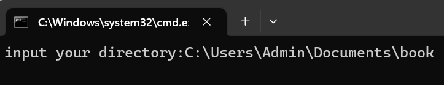

# Problem Statement

- How to automate the gitbook initialization, build and deploy?

User Guide:

1. Folder name is Title name of specific topic in this project, because it helps to save your time to give name to each
   topic. you can give a numerical string in the folder name. The book system will use the number to make the sorting.
   e.g. Naming example

- [x] Book name: {1-book_name}
- [x] Book name:{Chapter 1-book_name}
- [x] Book name:{A2. book_name}

e.g.
folder_name {1-gitbook} --> 1. Gitbook

# Project Workflow

# User Guide

## A. Prerequisites

- Windows 11
- Python 3.8.5 or above
- Gitbook (If you haven't installed gitbook, please refer to previous chapter to see the installation guide)
- Cablibre (Same as above)

## B. How to use

- Clone the from book/Gadget.
- Inside the "Gitbook Automation" should include "md_to_gitbook.py" and "gitbook_auto_package.bat" programs
- The programs helps you to collect "ReadME.md" file in the repository automatically
- Click the "gitbook_auto_package.bat" to run the script, make sure your current system satisfies the prerequisites.
- You can run the bat file with administrator permission to prevent some errors
  
- Input your absolute directory, e.g. C:\Users\Admin\Documents\book
  Make sure your root folder name of the project should be renamed to <mark>book</mark>
  
- In the command prompt, type "yes" to make sure your input directory is correct. It may cost you a lot of time if
  generating a large book file.
  

## C. Output Result

### C1. A pdf file named book.pdf

### C2. A static website repository

All files will stored in the "docs" folder, which is a special folder to help you build the page of github
Follow the instructions from previous chapter, you can display your book with a static website
If you understand the settings of github page and configure the page directory, commit and push this repository to
github. You can find your book in a static website @Thomas smile :)

Be patient, wait around 10 minutes to see the result in website.