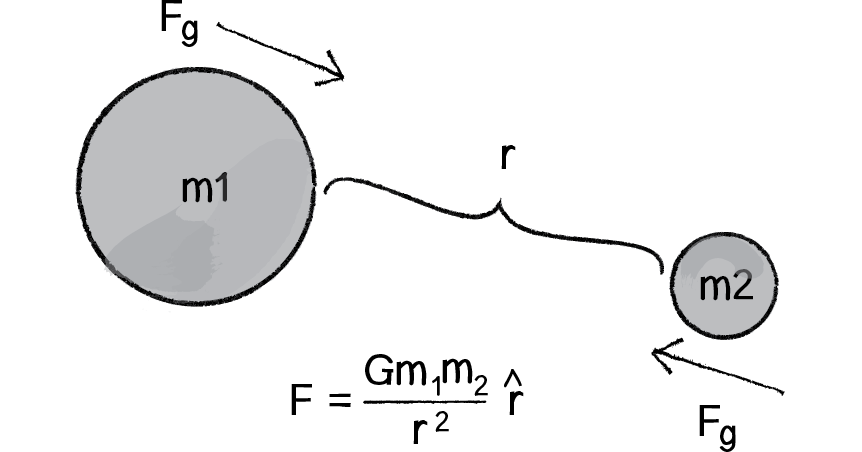
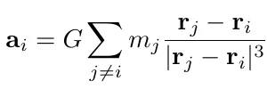

# A. Introduction

# B. Prerequistes

The original python code can be copied from github in the reference section. In our own code, we will use Jupyter
Notebook to implement the simulation for better analysis and visualization. So, you need following libraries and tools:

- Python 3.7
- Jupyter Notebook
- Numpy
- Matplotlib

# C. Theory

Gravitational Attraction:



Acceleration:



# D. Implementation

## D1. Initialization

```python
 # Simulation parameters
N = 100  # Number of particles
t = 0  # current time of the simulation
tEnd = 10.0  # time at which simulation ends
dt = 0.01  # timestep
softening = 0.1  # softening length
G = 1.0  # Newton's Gravitational Constant
plotRealTime = True  # switch on for plotting as the simulation goes along
```

## D2. Get acceleration of particles

```python
def getAcc(pos, mass, G, softening):
    # positions r = [x,y,z] for all particles
    x = pos[:, 0:1]
    y = pos[:, 1:2]
    z = pos[:, 2:3]

    # matrix that stores all pairwise particle separations: r_j - r_i
    dx = x.T - x
    dy = y.T - y
    dz = z.T - z

    # matrix that stores 1/r^3 for all particle pairwise particle separations
    inv_r3 = (dx ** 2 + dy ** 2 + dz ** 2 + softening ** 2)
    inv_r3[inv_r3 > 0] = inv_r3[inv_r3 > 0] ** (-1.5)

    ax = G * (dx * inv_r3) @ mass
    ay = G * (dy * inv_r3) @ mass
    az = G * (dz * inv_r3) @ mass

    # pack together the acceleration components
    a = np.hstack((ax, ay, az))

    return a
```

### D2.1 Current positions of particles

`pos = np.random.randn(N, 3)` will generate N*3 random matrix with mean 0 and variance 1 (standard normal distribution).

### D2.2 Distance between a particle and all other particles

Let take dx as an example

x = [[-1], [0], [1]]
x.T = [[-1, 0, 1]]
dx = x.T - x = [[0, 1, 2], [-1, 0, 1], [2, -1, 0]]

As a result, dx is a matrix that stores all pairwise particle separations: r_j - r_i

### D2.3 Softening

Softening is a technique used in simulations of 3D systems, particularly in astrophysics and gravitational physics, to
avoid singularities and numerical instabilities that can arise when two particles get too close to each other.

In other world, to prevent the distance becoming `0` in calculation, we add a small value to the distance.

# References:

Original Article: https://medium.com/swlh/create-your-own-n-body-simulation-with-python-f417234885e9