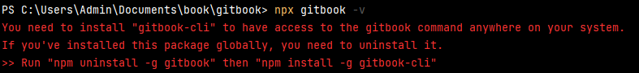
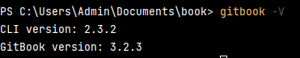

# A. Gitbook Installation

Install Gitbook with npm, npm is a package manager for JavaScript, it is installed with Node.js.

## A1. Prerequests

### Windows command prompt

You must use the windows cmd to install gitbook, otherwise, you will get unexpected error.

### Node.js install version 10.4.1

You need to install nvm for windows to manage the version of
Node.js. [nvm for windows](https://github.com/coreybutler/nvm-windows/releases)

```shell
nvm install 10.4.1
nvm use 10.4.1
```

### Install gitbook-cli instead of gitbook

You may find this error if install gitbook directly:


```shell
npm install -g gitbook-cli
```

### Fetch gitbook with default / specific version

```shell
gitbook fetch {version}
```

### Valiadate your installation

```shell
gitbook -V
```

Finally, you are able see the version of gitbook:



# B. Create First Gitbook

## B1. Create "SUMMARY.md" to include all "README.md" required to be shown in the book

```readme
# Summary

* [Gitbook Introduction](README.md)
```

## B2. Initialize gitbook

```shell

```shell
gitbook init
```

## B3. Generate static website

```shell
gitbook serve ./{book_name}
```

## B4. Out the directory of static website to target directory

```shell
$ gitbook build --output=/tmp/gitbook
```

```shell
$ ls /tmp/gitbook/
```

## B5. Generate PDF

Install Calibre to generate PDF, [download the application here](https://calibre-ebook.com/download_windows64)

```shell
gitbook pdf {book_name}
```

# C. Publish your book to github with a static website

## C1. Create page folder in your project

In your root directory of your project, create a folder named "docs"

```shell
mkdir docs
```

Copy and past the static website to the "docs" folder

## C2. Git hub Settings

In your project github repository, go to "Settings" -> "Pages" -> "Build and Deployments" -> "Branch: docs" -> "Save"

In my page you can see my [demo website here](https://hmlaiac.github.io/book/)

# Reference

Reference: [Gitbook Chinese](https://tonydeng.github.io/gitbook-zh/gitbook-howtouse/howtouse/gitbookinstall.html)
