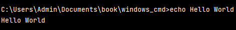
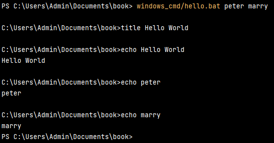
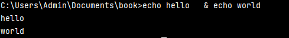
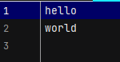

# Install plugins for windows bat/cmd

To help you to manage bat files, Jetbrains suggest you to install plugins.


## A. Basic setting commands

### Change command prompt title

```shell
title <title>
```

### Print out text

```shell
echo <text>
```



### System variables

```shell
echo %1
echo %2
```



After running command, we observe that command line run in bat/cmd file is linear. It means that it will run one by one.

## B. Run with some logics

In this example, we are going to create a new bat file named "logic.bat" to include some logical operations.

### Create a variable

```shell
set /A variable-name=value
```

- variable-name is the name of the variable you want to set.
- value is the value which needs to be set against the variable.
- /A – This switch is used if the value needs to be numeric in nature.

### Logic operations

In windows bat/cmd, we can't use symbolic operators like '>', '<' or '==' to build the logic.

- EQU - equal
- NEQ - not equal
- LSS - less than
- LEQ - less or equal
- GTR - greater than
- GEQ - greater or equal

example:

```shell
set /A a = 1, b = 2
rem run some logics
if %a% equ %b% (echo yes) else (echo no)
if %a% neq %b% (echo yes) else (echo no)
if %a% lss %b% (echo yes) else (echo no)
if %a% leq %b% (echo yes) else (echo no)
if %a% gtr %b% (echo yes) else (echo no)
if %a% geq %b% (echo yes) else (echo no)
```

## Other operators

### & operator

The & operator is used to execute commands in sequence, as if they were on the same line, separated by spaces. The
commands will be executed one by one. You can
write down this command in command prompt directly, but it runs successfully in bat/cmd file.

```shell
echo hello & echo world
```

### && operator

The && operator is used to execute commands in sequence, but the commands behind "&&" will be executed only if the
previous command is executed successfully.

```shell
find \"ok\" c:\test.txt && echo SUCCESS
```

### || operator
The || operator is used to execute commands in sequence, but the commands behind "||" will be executed only if the previous command occurs error.

```shell
find \"ok\" c:\test.txt || echo FAIL
```



### > operator
The > operator is used to redirect the output of a command to a file. If the file already exists, it will be overwritten.

In this example, we create a new file named "test.txt" and write down "hello" in it.

```shell
echo hello > windows_cmd/test.txt
```
Result:


### >> operator
The >> operator is used to redirect the output of a command to a file. If the file already exists, the new data will be appended to the end of the file.

In this example, we append "world" to the end of "test.txt".

```shell
echo world >> windows_cmd/test.txt
```



### < operator
The < operator is used to redirect the input of a command to a file.

In this example, we read the content of "test.txt" and print it out.
```shell
clip < windows_cmd/test.txt
```


Problems:
Can we automate gitbook build and push to github?

# References

[Tencent Docs](https://cloud.tencent.com/developer/article/2004968)

[Tutorialspoint](https://www.tutorialspoint.com/batch_script/index.htm)

